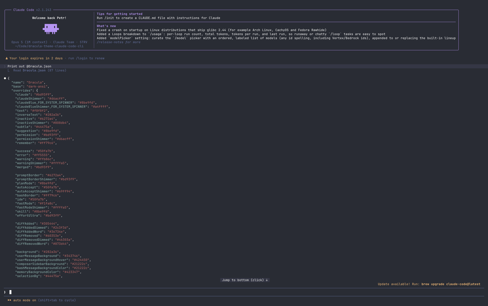

# Dracula for [Claude Code CLI](https://claude.com/product/claude-code)

> A dark theme for the [Claude Code](https://claude.com/product/claude-code) command-line interface.



## Install

Save `Dracula.json` into your Claude Code themes folder:

```bash
mkdir -p ~/.claude/themes
curl -fsSL -o ~/.claude/themes/dracula.json \
  https://raw.githubusercontent.com/dracula/claude-code-cli/main/Dracula.json
```

Then run `claude`, enter `/theme`, and select **Dracula**. If you just created the `themes` folder, restart `claude` once so it picks it up.

Needs Claude Code 2.1.118 or newer. Full instructions, including how to install with Git, are in [INSTALL.md](./INSTALL.md).

> [!NOTE]
> Dracula is already built into the Claude Code desktop app and [claude.ai](https://claude.ai).
> See [draculatheme.com/claude-code](https://draculatheme.com/claude-code) for those.
> The terminal app ships its own built-in themes.

## Team

This theme is maintained by the following person(s) and a bunch of [awesome contributors](https://github.com/dracula/claude-code-cli/graphs/contributors).

| [](https://github.com/pchalupa) |
| ---------------------------------------------------------------------------------------- |
| [Petr Chalupa](https://github.com/pchalupa)                                              |

## Community

- [Twitter](https://twitter.com/draculatheme) - Best for getting updates about themes and new stuff.
- [GitHub](https://github.com/dracula/dracula-theme/discussions) - Best for asking questions and discussing issues.
- [Discord](https://draculatheme.com/discord-invite) - Best for hanging out with the community.

## Dracula PRO

[](https://draculatheme.com/pro)

## License

[MIT License](./LICENSE)
